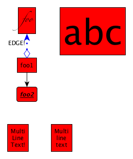

# yEd Py

A simple Python library to export networks to [yEd](http://www.yworks.com/en/products_yed_about.html)

The [yEd Graph Editor](https://www.yworks.com/products/yed) supports the [GraphML](http://graphml.graphdrawing.org/) ([GraphML Primer](http://graphml.graphdrawing.org/primer/graphml-primer.html)) file format. 
This is an open standard based on XML, and is supported by Python libraries such as [NetworkX](https://networkx.github.io/).
However, the details of formatting (rather than network topology) are handled by yEd specific extensions to the standard, which are not supported by other libraries.
 
I therefore wrote this library to provide an easy interface that lets you specify how a graph should look, and generates corresponding graphML that can be opened in yEd.

## Usage
The interface is similar to that of NetworkX:

    from pyyed import *    

    g = pyyed.Graph()    

    g.add_node('foo', font_family="Zapfino")
    g.add_node('foo2', shape="roundrectangle", font_style="bolditalic", underlined_text="true")    

    g.add_edge('foo1', 'foo2')
    g.add_node('abc', font_size="72", height="100", shape_fill="#FFFFFF")    

    g.add_node('bar', label="Multi\nline\ntext")
    g.add_node('foobar', label="""Multi
    Line
    Text!""")    

    print g.get_graph()
    

Saving this to a file with a ``.graphml`` extension, opening in yEd, applying  ``Tools -> Fit Node to Label`` and ``Layout -> One-click layout`` produces something like the following:

